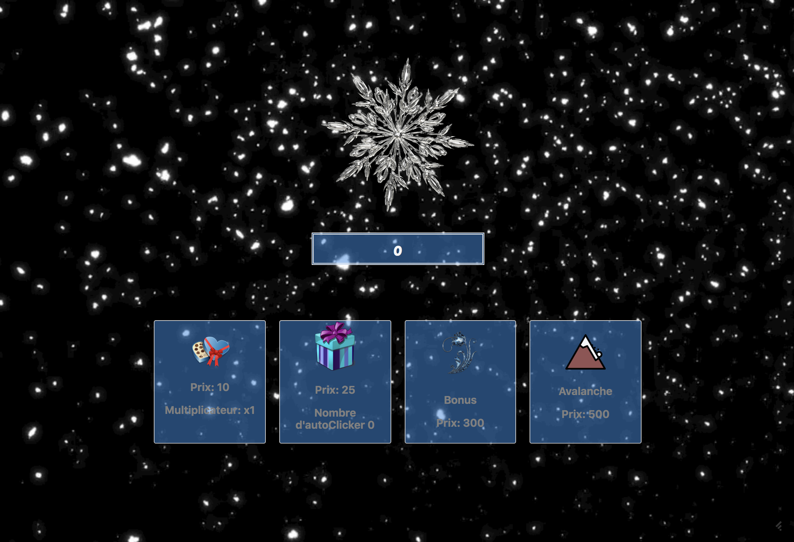

# Cookie Clicker

## Présentation du Projet
git 
Projet créé le 19 Novembre 2019 dans le cadre de la formation Web Developer donnée par [BeCode](https://www.becode.org/), dans le but d'améliorer nos compétences en JavaScript, en HTML et CSS, en git et en gestion d'équipe.

Le projet est réalisé sur base des [instructions données](https://github.com/becodeorg/CRL-Woods-2.15/tree/master/Parcours/02-Colline/11-Javascript/4.cookie_clicker).

Le projet est accessible sur sa propre [GitHub page](https://terencehecq.github.io/cookie-clicker/)

### **[Cookie Clicker](https://github.com/terencehecq/cookie-clicker)**

Le Projet consiste en une implémentation basique du jeu **Cookie Clicker** en JavaScript avec la possibilité d'acheter les trois modificateurs suivants:

- un multiplicateur qui augmente la valeur de chaque click
- un auto-clicker qui incremente automatiquement le score à la place de l'utilisateur
- un bonus qui _boost_ le score de 200% par click pour 30 secondes.

## Contributeurs

- [**Quentin De Paola**](https://github.com/quendepa)
- [**Alessandro Denys**](https://github.com/alessdenys)
- [**Gaudeline Durieux**](https://github.com/Gaudeline)
- [**Térence Hecq**](https://github.com/terencehecq)
- [**Kevin Labtani**](https://github.com/kevin-labtani)

## Langages

Projet réalisé entièrement en JavaScript, HTML et CSS.

## Progression

Projet terminé le 22 Novembre 2019.

## Remerciements

- [BeCode](https://www.becode.org/) pour la formation.
- [Arnaud Duchemin](https://github.com/Cervant3s) pour le coaching.
- La promotion **CRL-Woods-2.15** pour l'aide et le support.
